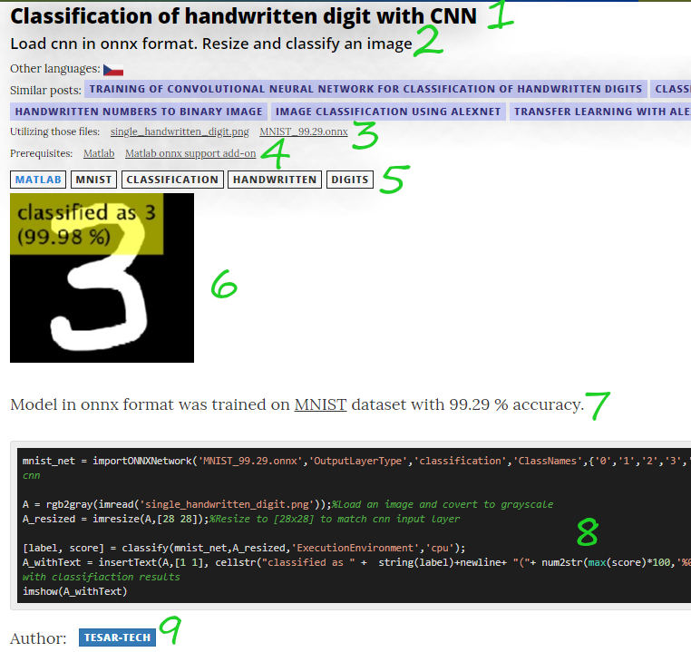

Title: About
---
## This is ZODOC
Samples from image processing and deep learning.

I would like to hear your opinion. Contributions are highly welcome. If you consider adding a new post, here are some guidelines for you. If you discover any mistake or you get an idea how to improve this site, submit an issue in [GitHub repo](https://github.com/tesar-tech/zodoc) or contact me by e-mail ( zodoc@zodoc.tech ).

## What should a post have?

1. Accurate **title**.
2. Apposite **lead** (description). What is going on in the post?
3. The **files** you need to run the sample code.
4. **Prerequisites** - what user must obtain/install to run the sample.
5. **Tags,** that help categorize the post. First tag is technology tag (Matlab, TensorFlow, PyTorch,...).
6. **Intro picture** (or animation as .gif) with result.
7. **Broader description** or more information if needed.
8. **Code** - commented and properly formatted.
9. **Author(s)**

(**other languages** and **similar posts** are auto-generated)

## How to add a new post 

### Opt.1:  Just send me an email...
Maybe all the Git and Markdown flow is too complicated, and you just want to write a post.

Feel free to send me (zodoc@zodoc.tech) document/code in format of your choice. I will check it push it to zodoc. Don't forget about tags, code, intro image, etc...

### Opt.2: GitHub & Markdown

Follow [other posts](https://github.com/tesar-tech/zodoc/tree/develop/input/posts/en). Open it as a plain text to see how metadata look like.

1. Fork repo from https://github.com/tesar-tech/zodoc. 
2. Pull repo and navigate to `input/posts/en`, here you can add your new post.
3. Name your post based on a title `with_lower_case_letters_and_without_spaces.md`
4. Add intro image to `input/post/imgs_intro`, with same name as post (without .md extension)
5. Add code block and other metadata like prerequisites, tags, authors and publish date (in YYYY-MM-dd format)
6. Create pull request.

## Other info

- If possible, use [this picture of flower](https://github.com/tesar-tech/zodoc/raw/master/datazoo/imgs/kytka256.jpg) for your samples, otherwise add necessary files to `datazoo` folder.
- Prerequisites are links to [prerequisites](prerequisites) page that contains more informations about obtaining, etc. If you add new prerequisit, it is also necessary to edit that page.
- Support for another languages is half-way done. On some posts you can see small Czech flag that leads you to same post in Czech language, even though these translated posts are not listed on index page. It should be relatively easy to add new language and translated posts. If you wish to add new language and translated post, just let me know.
