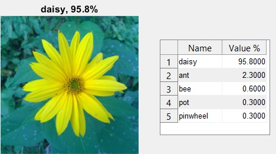
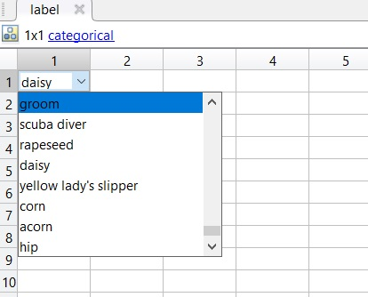

title: Aplikace konvoluční sítě alexnet pro klasifikaci obrázků
Description: Použití konvoluční sítě alexnet pro klasifikaci obrázku.
---
>Tento dokument pracuje s [obrázkem](/zodoc/assets/img/kytka256.jpg) uloženém v proměnné`A`. Obrázek musí být ve složce, ve které současně pracujete s matlabem. 


# Obecná definice konvoluční neuronové sítě Alexnet
Konvoluční neuronová síť alexnet má naučeno více než milion různých obrázků z databáze ImageNet. Tato síť má osm vrstev a dokáže obrázky či vybrané výřezy obrázků klasifikovat do více než tisíc kategorií, pro příklad: klávesnice, různá zvířata a mnohé další. 
Výsledkem je klasifikování obrázku (název toho, co na něm je) a hodnota uvádějící procentuální jistotu zařazení obrázku.


# Nainstalovat přídavný prvek 'alexnet' do matlabu
```matlab
alexnet 
%zadáme do command line v Matlabu a postupujeme podle pokynů, pro instalaci
%je nutné mít účet na https://www.mathworks.com/
```

# Načíst síť alexnet do proměnné
```matlab
net = alexnet; %provede načtení neuronové sítě do proměnné net
A = imread('kytka256.jpg'); %načte obrázek
A_resized = imresize(A,[227 227]); %upraví velikost obrázku, síť alexnet
% vyžaduje na vstupu obrázek o rozměrech: 227px x 227px
[label,score] = classify(net,A_resized); % klasifikuje obrázek, kdy se ukládá
%pojmenování klasifikace do proměnné label a proměnná score
%slouží k vyjádření míry přesnosti v procentech alexnet 
%a druhým parametrem je obrázek ve správné vstupní velikosti
figure
imshow(A_resized);
title(string(label) + ", " + num2str(max(score)*100,3) + "%"); %zobrazí název a procenta
```


## Závěr
Výstupem je figura, v níž je nadpisem název dle alexnet a procentuální jistota.
V tomto příkladu užitá neuronová síť vyhodnotila obrázek jako sedmikrásku (Daisy), přestože se ve skutečnosti jedná o květ topinambury.
Dále je důležité zmínit, že lze dohledat jaké další možnosti algoritmus při klasifikaci zvažoval, tyto názvy jsou uložené pod proměnnou label a při rozkliknutí můžeme prohledávat v tabulce.


Budoucnost v těchto sítích je obrovská, nicméně je potřeba je ještě hodně učit.

