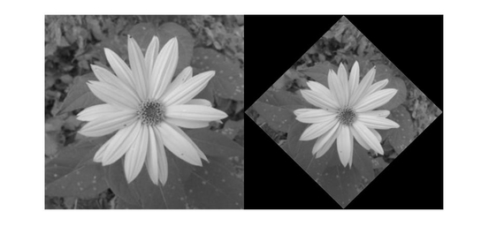

title: Afinní transformace obrázku pomoci rotace
--- 
Transformační matice T je matice o velikosti 3x3, která se používá k provedení operace posunu, rotaci a odražení objektů v afinní transformaci 2D obrázků vůči původním souřadnicím osy.

 

Rotace obrázků se provádí proti směru hodinových ručiček. Matice T popisuje otáčení bodu ve původních souřadnicích.

		T = ( cos(φ) -sin(φ)  
		      sin(φ)  cos(φ) )
Pro rotaci po směru hodinových ručiček je nutné se počítat se zápornou hodnotou uhlu φ.
		
		T = ( cos(φ) sin(φ)  
		     -sin(φ) cos(φ) )
Funkce affine2d(T) přirázuje matici vlastnosti platnou afinní transformací matice T. Výsledná afinní transformace obrázku se provádí pomoci funkci imwarp(), kde se obrázek mění podle definovaného formátu rotaci.

		(X' Y') = (X Y) * (cos(φ) -sin(φ)   
						   sin(φ)  cos(φ) )
						   		 
---				
```
 ``` matlab
A = rgb2gray(imread('kytka256.jpg')); %načitani obrazku a prevedení do šedotonu
uh = pi/4; %uhel pi je urcen pro zadavani centrální symetrii vzhledek k puvodnim souradnicim osy

T = [ cos(uh)  sin(uh) 0; %matice T o velikosti 3x3 nastavuje afinní transformaci roviny
      -sin(uh) cos(uh) 0  %cos(uh) ,sin(uh), -sin(uh), cos(uh) zadavaji uhly otačeni obrazku kolem sve osy pro provedeni Rotaci
        0       0      1 ];%posledni řadek {0 0 1} určuje posun obrazku podél os X a Y(pro Translation)
                                                 
tform = affine2d(T); %nastavuje vlastnosti matice T s platnou afinní transformací pro maticí tform
J = imwarp(A,tform); %transformuje obrazek A podle geometrické transformace s definovanym formátem v tform

montage([{A},{J}])%zobrazuje puvodni a transformovany obrazky do jedneho snimku

