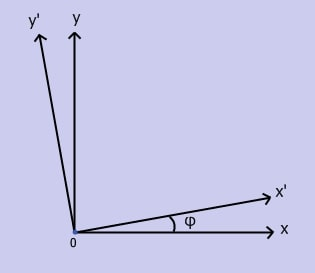

title: Afinní zobrazení obrazku
--- 
# Afinní rotace obrazku
Pro provedeni afinní rotace potřebujeme otáčet obrázek vzhledem k původním souřadnicím osy a použit pro nastavení otáčení úhel (φ).

 

Počítáme se s tím, že směr otáčení je  pozitivní proti směru hodinových ručiček. Je výhodné předpokládat, že úhel φ je v intervalu [-pi; pi].
Abychom získali transformaci souřadnic během rotace, vezmeme si libovolný vektor r, který definuje určitý bod. Jeho souřadnice jsou:

		x = |r|cos(α)
		y = |r|sin(α)
Při otačení obrazku o úhel φ, souřadnice X a Y procházejí transformací:

		x'=|r|cos(α+φ) = |r|(cos(α)cos(φ)) - sin(α)sin(φ) = x cos(φ) - y sin(φ)
		y'=|r|sin(α+φ) = |r|(sin(α)cos(φ)) + cos(α)sin(φ) = x sin(φ) + y cos(φ)
		
Z uvedených rovnic odvodíme matice, díky které snadno spočítáme výslednou matice afinní rotaci obrázku. Násobení matic se provádí podle principu násobeni řádku na sloupec, proto počet sloupců v matici vlevo musí odpovídat počtu řádků v matici vpravo.

		(x' y') = (cos(φ) -sin(φ)    * (x y)
				   sin(φ)  cos(φ) )


Tímhle tím způsobem dokázali jsme posunout obrázek určeným před tim kladným směrem (proti časové ručičce). Ale pokud bychom potřebovali udělat rotace po směru hodinové ručičce, přiradíme uhlu *φ* zápornou hodnotu (protože pohybujeme proti určeného směru) a přepočítáme vztah  pro stejný uhel se záporným znaménkem.

	
		(x' y') = (cos(-φ) -sin(-φ)  * (x y) = (cos(φ) sin(φ)  * (x y)
				   sin(-φ)  cos(-φ) )          -sin(φ) cos(φ) )
		 
```
 ``` matlab
A = rgb2gray(imread('kytka256.jpg')); %načitani obrazku a prevedení do šedotonu
uh = pi/4; %uhel pi je urcen pro zadavani centrální symetrii vzhledek k puvodnim souradnicim osy

T = [ cos(uh)  sin(uh) 0; %matice T o velikosti 3x3, zadava uhly otačeni obrazku kolem sve osy(Rotace/Rotation)
      -sin(uh) cos(uh) 0  %posledni sloupec {0 0 1} nastavuje afinní transformaci roviny
        0       0      1 ];%posledni řadek {0 0 1} určuje posun obrazku podél os X a Y(pro Translation)
                                                 
tform = affine2d(T); %nastavuje vlastnosti matice T s platnou afinní transformací pro maticí tform
J = imwarp(A,tform); %transformuje obrazek A podle geometrické transformace s definovanym formátem v tform

montage([{A},{J}])%zobrazuje puvodni a transformovany obrazky do jedneho snimku

