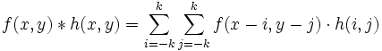

title: Konvoluce - Klouzavý průměr
Description: Stručné vysvětlení konvoluce za použití klouzavého průměru na jednorozměrném signálu a obraze.
---
>Tento dokument pracuje se třemi obrázky:

* [Obrázek kytky](../media/kytka256.jpg) v proměnné `A` 

# Konvoluce

Konvoluce je matematický nástroj používaný při úpravách všech možných druhů signálů. Konvoluční filtry jsou aplikovany na fotografie a v mnoha dalších oblastech.

# Konvoluce jednorozměrného signálu
Konvoluce pilovitého signalu 
```matlab
signal = sawtooth(1:50); % vygeneruje pilovitý signal 
mask = [1/4 1/4 1/4 1/4]; % maska pro čtyři prvky 
convsignal = conv(signal,mask); 
plot(signal,'b'); % vykreslení původního signálu modře
hold on;
plot(convsignal,'r'); % vykreslení signalu červeně
```

# Konvoluce dvourozměrného pole


Konvoluční jádro 2x2 a hodnotami 0,25 prochazi 3x3 matici.

Postup: 
* Vynásobíme hodnoty konvolučního jádra hodnotami, které leží pod konvolučním jádrem v matici.
* Součet těchto násobků uložíme do právě zpracovávané buňky.
* Posuneme se o buňku dále.


# Konvoluce obrazu
Obraz převedeme do stupně šedi a projde přes něj konvoluční jádro 10x10 s hodnotami 0,01.

``` matlab
A = imread('kytka256.jpg'); % načtení obrázku
si = 10;
M = ones(si)/si^2; % vytvoření konvolučního jadra 10x10 s hodnotami 0,01
A = mat2gray(rgb2gray(A)); % stupně šedi z uint8 do double
imgconv = conv2(A,M,'valid'); % konvoluce obrazu A a konvolučního jádra M
figure(1);
subplot(1,2,1), imshow(A); % puvodní obráz
subplot(1,2,2), imshow(imgconv); % obraz po konvoluci
```

