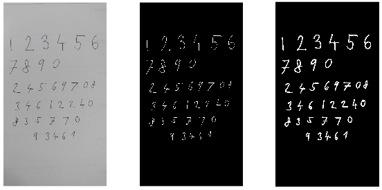

title: Fotka s ručně psanými čísly na binární obraz
Description: Konverze ručně psaných čísel do binárního obrazu
---
>Tento dokument pracuje s [obrázkem čísel na papíře](/zodoc/input/media/cisla_ver.jpg) uložený v proměnné `A`.

Zkonvertovat obrázek do binární reprezentace, kde jednotlivá čísla budou reprezentována bílou barvou a pozadí černou. Pro zvýraznění čísel k budoucí klasifikaci natrénovanou neuronovou sítí bude využita operace z matematické morfologie nazvaná dilatace, která je v MATLABu implementována pomocí funkce `imdilate`.



```matlab
A = imread('cisla_ver.jpg'); % načtení obrazu
AGray = rgb2gray(A); % konverze do šedotónu
ABinary = imbinarize(AGray, 'adaptive', 'ForegroundPolarity', 'dark', 'Sensitivity', 0.3); % binarizace obrazu. ForegroundPolarity parametr značí ,že popředí je tmavší, než pozadí.
ABinaryComplement = ~ABinary; % bitová inverze matice
StructuringElement = strel('disk', 7); % vytvoření strukturního elementu ve tvaru kruhu, který slouží k prozkoumání původního obrazu
DilatedABinaryComplement = imdilate(ABinaryComplement, StructuringElement); % dilatace obrazu
subplot(1, 3, 1), imshow(A)
subplot(1, 3, 2), imshow(ABinaryComplement)
subplot(1, 3, 3), imshow(DilatedABinaryComplement)
```