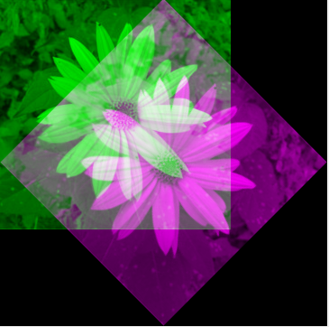
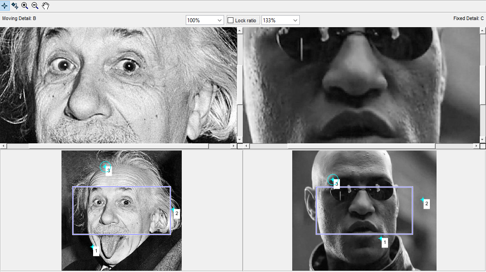
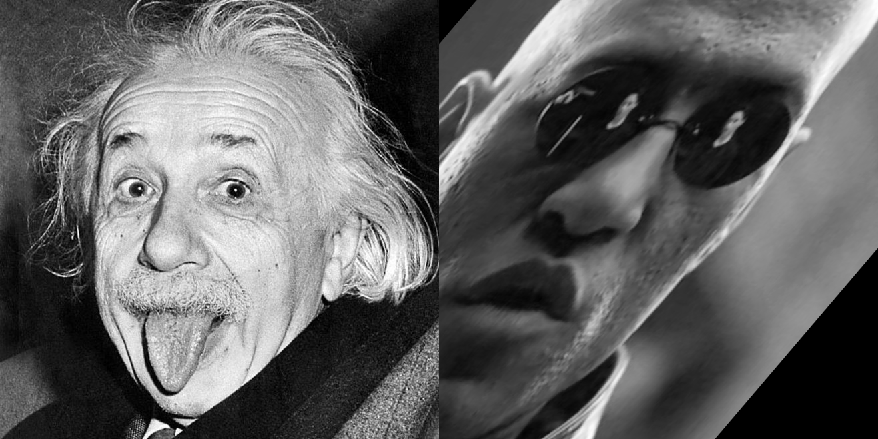
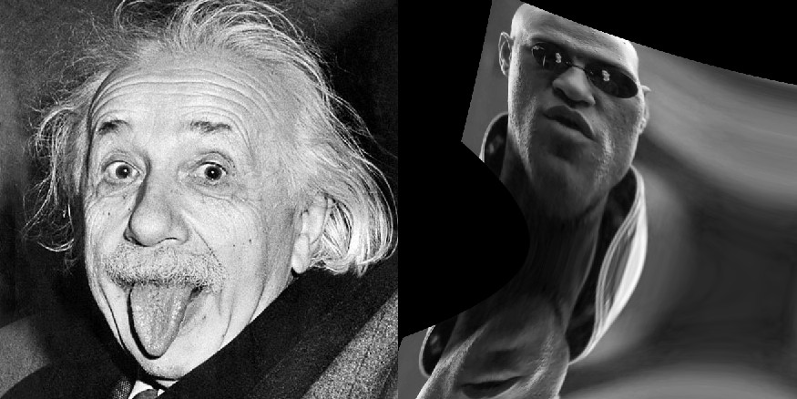

title: Registrace obrazu
---
>Tento dokument pracuje se třema obrázky: 

* [Obrázek kytky](../media/kytka256.jpg) v proměnné `A` 
* [Obrázek Einsteina](../media/einstein.jpeg) iv proměnné `B` 
* [Obrázek Morpheusa](../media/morpheus.jpg) iv proměnné `C` 
# Posunutí o 20 a 30 pixelů
``` matlab
T = [1 0 0;
    0 1 0;
    30 20 1];
[bo1, bo2] = meshgrid([1 2]);
poi=[bo1(:),bo2(:),ones(4,1)];
poi_pos = poi*T;
```
# Otočení obrázku pomocí transformační matice
``` matlab
A = rgb2gray(imread('kytka256.jpg'));
uh = pi/4;
T = [cos(uh) sin(uh) 0;
    -sin(uh) cos(uh) 0
    0 0 1 ];
tform = affine2d(T); %vytvoři to transoformační objekt
J = imwarp(A,tform);%transformace obrázku
imshowpair(A,J);
```


# Fitování obličejů pomocí různých transformačních typů 
``` matlab
B = rgb2gray(imread('einstein.jpeg'));
C = rgb2gray(imread('morpheus.jpg'));
cpselect(B,C); % vybere body 
``` 


## Kopirování vybranných bodů  do proměnných "pA a pB"
``` matlab
point_B = fixedPoints;
point_C = movingPoints;
```
## Transformační typ "affine"
``` matlab
tform = fitgeotrans(point_B,point_C,'affine');
Cb = imwarp(C,tform,'OutputView',imref2d(size(B)));
imshowpair(B,Cb,'montage')
```


## Transformační typ "polynomial"
``` matlab
tform = fitgeotrans(point_B,point_C,'polynomial',2);
Cb = imwarp(C,tform,'OutputView',imref2d(size(B)));
imshowpair(B,Cb,'montage')
```


# Tvorba "animace" 
``` matlab
frames = 20;
for i = 0 : frames - 1
    t = i / frames;
    points_grad = point_B + t * (point_C - point_B);
    tformA = fitgeotrans(point_B,points_grad,'affine');
    tformB = fitgeotrans(point_C,points_grad,'affine');   
    frameA = imwarp(B,tformB,'OutputView',imref2d(size(B)));
    frameB = imwarp(C,tformA,'OutputView',imref2d(size(B)));
    blend = (1 - t) * frameA + t * frameB;
    blend (isnan (blend)) = 0;
    imwrite (blend, ['animace/' num2str(i, '%02i') '.png']); % zápis obrázku do složky "animace"
end
```
