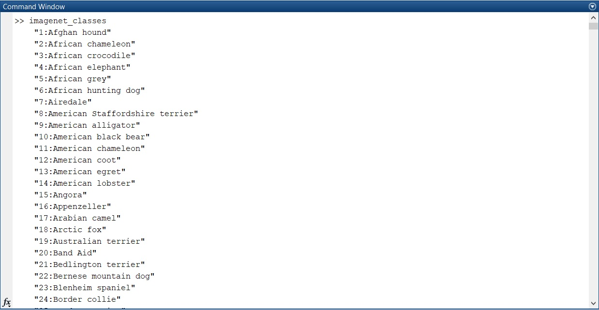

title: Zobrazení tříd neuronových konvolučních sítí
Description: Zobrazení tříd z konvoluční sitě Alexnet v čitelné podobě
---
>Tento dokument pracuje s konvoluční neuronovou sítí Alexnet.

#Proč si vytvořit jednoduchý skript pro zobrazení klasifikací
Často se stává, že je potřeba se podívat na možné třídy neuronových klasifikačních sítí, pro zjištění, zda má možnost konkrétní obrázky vůbec klasifikovat. Pro příklad, je potřeba klasifikovat obrázek želvy, v tom případě lze zobrazit následujícím kódem třídy podle abecedy a vyhledat zda se zde nachází v tomto příkladě "Turtle". Takové třídění lze provést nejen u konvoluční neuronové sítě Alexnet, ale je možné i pro další sítě př.:(googlenet,squeezenet,densenet201,resnet18...)


# Zobrazit třídy s pozicemi použitím Alexnet

```matlab
net = alexnet; % načíst sít
classNames = net.Layers(end).ClassNames; %uložit všechny názvy tříd do proměnné
sorted_classNames = sort(classNames); % třídit názvy sítí podle abecedy
class_Indexes = string(num2cell(1:1000)'); % vytvořit indexování pro zobrazení podle abecedy
str=strcat((sorted_classNames)); % seřadit názvy horizontálně
a = strcat(class_Indexes,repmat(":",1000, 1),str); % přiřadit do proměnné názvy tříd a očíslovat je

disp(a) %Zobrazit výsledky
```

