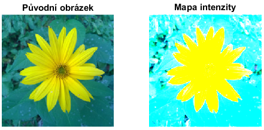
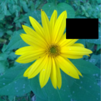

title: Základní operace s obrázky 2
Description: Druhá část základních operací s obrázky
---
>Celá tato sekce operuje s výchozím [obrázkem](/zodoc/assets/img/kytka256.jpg) v proměnné `A`. `A=imread('kytka256.jpg');`

# Mapa intenzity s rozsahem od 0 do 1

```
% parametry [amin amax] určují práh minima a maxima
% A(typ uint8) => B(typ double) v rozsahu 0-1
B = mat2gray(A,[18 69]);%pixely menší než 18 budou 0. Pixely větší než 69 budou 1

subplot 121;imshow(A);title('Původní obrázek');
subplot 122;imshow(B);title('Mapa intenzity');
```

# Animace barevného pruhu


Zakomentované bloky se dají použít k uložení animace do gifu

``` matlab
Ag = rgb2gray(A);
figure; ax = axes;
stripe_height = 20;
runs = 10;% opakovat animaci desetkrát

% gifName = 'moving_stripe.gif';
% firstTime = 1;
% runs = 1;

for ii=1:runs 
    for i=1:stripe_height:size(Ag, 1)
        
        currentImage = A;
        currentImage(1:i, :, :) = repmat(Ag(1:i, :),[1 1 3]);
        currentImage(i+stripe_height:end, :, :) = repmat(Ag(i+stripe_height:end, :),[1 1 3]);
        
        imshow(currentImage,'Parent',ax);
        pause(0.1) % pozastavit na 0.1 s
        
%         [A_to_save,map] = rgb2ind(currentImage,256);
%         if firstTime ==1%první snímek v animaci je uložen jiným způsobem
%             imwrite(A_to_save,map,gifName,'gif','LoopCount',Inf,'DelayTime',0.001);
%             firstTime = 0;
%         else
%             imwrite(A_to_save,map,gifName,'gif','WriteMode','append','DelayTime',0.001);
%         end
        
    end
end

```


# Plátno opakujících se obrázků


``` matlab
raster = ones (5);
raster([7:9,12,17:19,14]) = 0;
canvas = repmat(raster,20,20);
imshow(canvas)
```
# Zmenšování a zvětšování obrázku
Oba způsoby (procentuálně i podle počtu pixelů) lze použít ke zvětšování i zmenšování.
## Zmenšování


``` matlab
A_scaledDown = imresize(A,0.3);%  30 % velikosti původního obr.
imshow(A_scaledDown)
```
## Zvětšování

```matlab
A_scaledUp = imresize(A,[300 400]);% počet pixelů. Nezachová poměr stran.
imshow(A_scaledUp)
```

# Ořezávání

``` matlab
A_cropped = A(50:100,170:250,:);% dvojtečka značí "ve všech kanálech"
imshow(A_cropped)
```
# Začernění části obrázku

``` matlab
A_replaced = A; % kopie původního obrázku
A_replaced(50:100,170:250,:) = 0;
imshow(A_replaced)
```

# Změna jasu

``` matlab
A_brighter = A+0.3;
A_darker = A-0.3;
figure;
subplot 131;imshow(A_darker);
subplot 132;imshow(A);
subplot 133;imshow(A_brighter);
```
# Histogram obrázku

Histogram je grafické znázornění distribuce jasu v obrázku


``` matlab
imhist(A)
```
