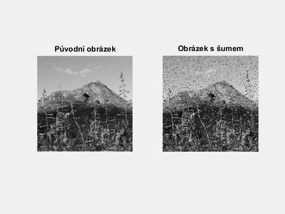
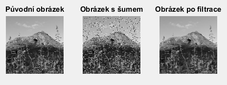
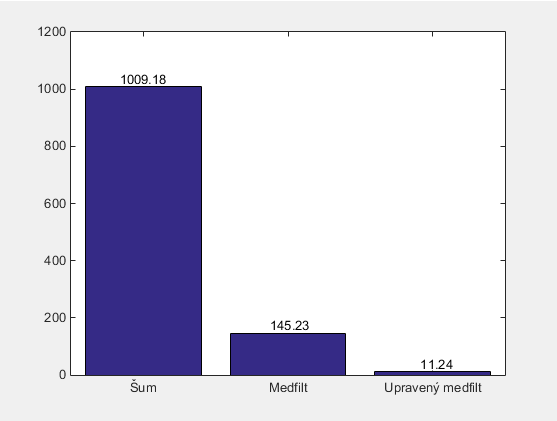

title: Různé způsoby, jak sestavit a používat mediánový filtr.
---
>Tento dokument pracuje s  obrázkem: 

* [Obrázek Norska](../media/nor256.jpg) v proměnné `A` 

# Načtení obrázku a přidání šumu.
``` matlab
A = rgb2gray(imread('nor256.jpg'));
A_noise = imnoise(A,'salt & pepper');
subplot 121;imshow(A);title 'Původní obrázek'
subplot 122;imshow(A_noise);title 'Obrázek s šumem'
```


# Pomocí for-cyklu
``` matlab
Amargin = padarray(A_noise,[1 1]); 
Afiltered_cycle = zeros(size(A_noise));
for a = 2:size(Amargin,1)-1
    for b = 2:size(Amargin,2)-1
        CurrentWindow = Amargin(a-1:a+1,b-1:b+1); % vybere okno 3x3
        sortedWindow = sort(CurrentWindow(:));
        Afiltered_cycle(a-1,b-1) = sortedWindow(5); % vybere medianu
    end
end
```
# Pomocí nlfiltru
``` matlab
fun = @(x) median(x(:));
Afiltered_nlfilter = nlfilter(A_noise,[3 3],fun);
```
# Pomocí ordfiltru
``` matlab
Afiltered_ordfilt2 = ordfilt2(A_noise,5,true(3));
```
# Pomocí medfiltru
``` matlab
Afiltered_medfilt2 = medfilt2(A_noise,[3 3]);
```
# Porovnání výsledků
``` matlab 
subplot 131;imshow(A);title('Původní obrázek')
subplot 132;imshow(A_noise);title('Obrázek s šumem')
subplot 133;imshow(Afiltered_medfilt2);title('Obrázek po filtrace')
if isequal(Afiltered_cycle,Afiltered_nlfilter,Afiltered_ordfilt2,Afiltered_medfilt2)
    disp('Všichni výsledky jsou stejné !')
end 
```

# Vylepšení medianového filtru
``` matlab
isNoise = (A_noise==255 | A_noise==0); %bilé a černé body
M = medfilt2(A_noise); %medfiltr
F = A_noise;
F(isNoise) = M(isNoise); % nahrazení vádných pixelů medianovou hodnotou
immse2=@(x,y)sum(sum((double(x) - double(y)).^2))/numel(x); % Kontrola MSE – v novejsim matlabu je immse
%Vykresleni grafu
close all
errnum = 1;
labels_X =[];err=[];
err(errnum) = immse2(A, A_noise);labels_X{errnum} ='Šum';errnum= errnum+1;
err(errnum) = immse2(A, M);labels_X{errnum} ='Medfilt';errnum= errnum+1;
err(errnum) = immse2(A, F);labels_X{errnum} ='Upravený medfilt';errnum= errnum+1;
bar(err)
set(gca,'XTickLabel',labels_X) % nastaví text na osu x
text(1:length(err),err',num2str(err','%0.2f'),'HorizontalAlignment','center','VerticalAlignment','bottom')
```
