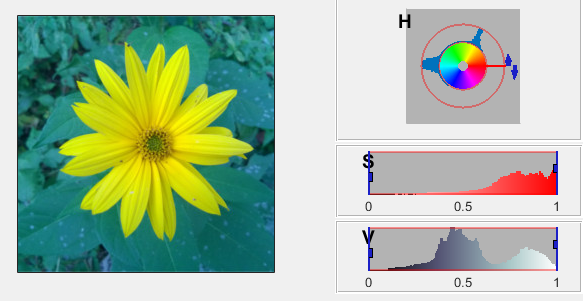

title: Segmentace
---
>Tento dokument pracuje s obrázkem: 

* [Obrázek kytky](../media/kytka256.jpg) v proměnné `A` 

# Vypočet prahové hodnoty
``` matlab
A = imread('kytka256.jpg');
Gray = rgb2gray(A);
prah = graythresh(Gray); % vypočítá globální prahovou hodnotu, metodou Otsu
prah2 = multithresh(Gray,2); % vypočítá 2 prahové úrovně
```
# K-means
``` matlab
[vektor, C] = kmeans(double(Gray(:)),3);
mean(C)
Gr_vektor= (reshape(vektor,size(Gray))); % změna na původní velikost
Gr_vektor_BW = Gr_vektor - 1;
imshow(Gr_vektor_BW) % zobrazení obrázku
colormap jet % změna barevné mapy
```


# Aplikace pro zobrazení prahu.
``` matlab
colorThresholder
```


# Prah s pomocí graytresh z barevného HSV modelu
``` matlab
A_hsv = rgb2hsv(A); % převod RGB hodnot do HSV modelu
A_hsv_Hue = A_hsv(:,:,1); % pozice barvy
th = graythresh (A_hsv_Hue); 
A_hsvTh=A_hsv_Hue<th;
A_hsv2= A_hsv;
A_hsv2(:,:,2) =A_hsv2(:,:,2) .* A_hsvTh; % množství odstínu 
A2 = hsv2rgb(A_hsv2); % převod HSV hodnot zpět do RGB
imshow(A2,[])
```


# K-means segmentace s 1 parametrem
``` matlab
Ag = rgb2gray(A);
barva = double(Ag(:));%barevná složka
k = kmeans(barva,2);
K2 = reshape(k,size(Ag)); % změna na původní velikost
imshow(uint8(K2),[])
colormap ('hot') % změna barevné mapy
```


# K-means segmentace s 3 parametry
``` matlab
A_gr=rgb2gray(A); 
mesh=meshgrid(1:size(A_gr,1),1:size(A_gr,2)); % vytvoření meshgridu 256 x 256
m1=double(mesh(:)); % první transformace na sloupec "x" souřadnice
mesh=mesh'; % transponování matice
m2=double(mesh(:)); % druhá transformace na sloupec "y" souřadnice
m0=double(A_gr(:)); % hodnoty pixelu
vektor = [m0 m1 m2]; % spojení do matice
segmentation = kmeans(vektor,20); %vektor segmentováných pixelu
segmented_A=reshape(segmentation,size(A_gr)); % změna na původní velikost
imshow(uint8(segmented_A),[])% zobrazení obrázku
colormap HSV % změna barevné mapy
```


