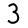

Title:MNIST database
Description: Classification of the number using a trained network 
---
>This document works with the image:
[Image of the number](.../media/2018-11-28-16-41-21.png) in `img3` variable.

MNIST is a large database of handwritten digits that are used to train different systems in image processing as well as training and testing in the field of machine learning.

  Test image must be black-and-white with size of (28x28) and line thickness (2 pixels). The number must be centered on the center and the image must be gray.

  
``` matlab
mnist = importONNXNetwork('MNIST_99.29.onnx','OutputLayerType','classification','ClassNames',{'0','1','2','3','4','5','6','7','8','9'}); %Import MNIST cnn

img3 = imread('trojka.png');%Load an image

img1 = imresize(img3,[28 28]);%Resize to (28x28)

trojkabw = rgb2gray(img1);%Convert to gray

trojka = imcomplement(trojkabw);%Adding grayscale to the original image

[label, score] = classify(mnist,trojka,'ExecutionEnvironment','cpu');
disp(label);%After exporting and importing the model, the GPU reports an error. Therefore, we will use the CPU for classification
``` 