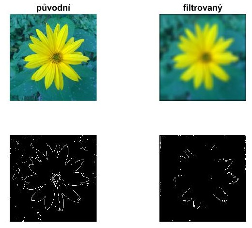

title: Compare the sharpness of two images
--- 
# Image blurring, edges detection
 ``` matlab
A=imread('kytka256.jpg');
% creating a Gaussian filter,12 is a size of the filter, 10 is a sigma alias a standard deviation
f=fspecial('gaussian',12,10);
A_rozmazana=imfilter(A,f); % application of the created filter to the image

A_rozm_seda=rgb2gray(A_rozmazana);
A_seda=rgb2gray(A);
% function 'edge' detects edges in the image, returns a binary image
A_rozm_E=edge(A_rozm_seda);
A_seda_E=edge(A_seda);

 ```
# Comparison of sharpness by edges
The basic assumption is, that the function 'edge' finds more edges in the sharper image.
 ``` matlab
 % the returned matrix of the function 'edge' is binary (contains only 0 and 1). 1 represents an edge
 % just need to compare in which matrix is more ones
C=find(A_seda_E==1); 
B=find(A_rozm_E==1);
if (length(C)>length(B))
    disp('The original image is sharper');
elseif (length(C)<length(B))
    disp('The filtered image is sharper');
else
   disp('It is not possible to determine the sharpest image'); %for example, the images have the same number of edges
end 
 ```
# Rendering the result
 ``` matlab
subplot (2,2,1); imshow(A); title('original');
subplot (2,2,2); imshow(A_rozmazana);  title('filtered');
subplot (2,2,3); imshow(A_seda_E);
subplot (2,2,4); imshow(A_rozm_E);  
 ```
 
 
