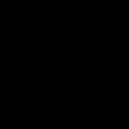

title: Basic Operations on Images 1
Description: First part of basic operation on images
---
>This whole document works with [image](/zodoc/assets/img/kytka256.jpg) in `A` variable.
# Load and show image 
```matlab
A=imread('kytka256.jpg');
imshow(A))
```


Image has to be in current folder !
# Convert RGB image to grayscale 
```matlab
Ag = rgb2gray(A);
imshow(Ag)
```


# Decompose RGB channels 
``` matlab
R=A(:,:,1);
G=A(:,:,2);
B=A(:,:,3);

subplot 221;imshow(A);title('original image');
subplot 222;imshow(R);title('red channel');
subplot 223;imshow(G);title('green channel');
subplot 224;imshow(B);title('blue channel');
```
Notice dark color in blue channel, which is not part of yellow color unlike red and green channels.


## Colorize channels

Set non-color channels to zero 

``` matlab
R(:,:,[2,3])=0; 
G(:,:,[1,3])=0;
B(:,:,[1,2])=0;

subplot 221;imshow(A);title('original image');
subplot 222;imshow(R1);title('red channel');
subplot 223;imshow(G1);title('green channel');
subplot 224;imshow(B1);title('blue channel');
```


# Negative image

```matlab
An=imcomplement(A);
%or
An= 255-A;%if image is uint8 type
imshow(An)
```


# Black & White

``` matlab
Abw = imbinarize(Ag);%from gray image
%BW = im2bw(A);% in older versions of matlab
imshow(Abw)

```


## Custom way
Result of `Ag<128` is binary matrix - i.e. b&w image
``` matlab 
imshow(Ag<128);
```
# B&W animation
``` matlab
figure
ax = axes;% because of rewriting parent figure
THR=0;
for i=1:100
    while (THR<=255)
        imshow(Ag>THR,'Parent',ax)
        THR=THR+10;
        pause(0.05)
    end
    while (THR>=0)
        imshow(Ag>THR,'Parent',ax)
        THR=THR-10;
        pause(0.05)
    end
end
```
## Save animation as GIF
``` matlab
firstTime = 1;gifName = 'bw_anim.gif';
for ii = 1:5:256
    
   curr_img = (Ag<ii)*255;%0 and 255 values
   [A,map] = gray2ind(curr_img,2); 
   
    if firstTime ==1%first frame is saved differently
        imwrite(A,map,gifName,'gif','LoopCount',Inf,'DelayTime',0.001);
    firstTime = 0;
    else
        imwrite(A,map,gifName,'gif','WriteMode','append','DelayTime',0.001);
    end 
 end
```



