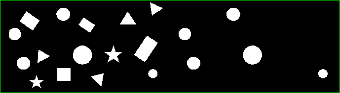

title: Distinguish between round and other binary objects
Description: From black&white image with different objects, select only round ones (circles).
---
>This is a continuation from [previous post](filtering_binary_objects_with_kmeans) that is about processing of image with shapes.



``` matlab
reg_props2 = regionprops(Aa{6},'perimeter','EquivDiameter','area');

[~,L] = bwboundaries(Aa{6},'noholes');% marking regions by numbers from 1:num_of_regions

%circle objects on the image are not perfectly round. Looking for "almost" round objects
%EquivDiameter is diameter for circle with same Area as object.
%Area/Perimeter + smallConstant > EquivDiameter/4   for round objects
%round objects (circles) have topmost Area/perimeter ration from all objects.
% Area/Perimeter = Diameter/4 for circles 
where_is_true =([reg_props2.Area] ./ [reg_props2.Perimeter]+1) > [reg_props2.EquivDiameter]/4;
 
Aa{7} =  ismember(L, find(where_is_true));

montage({Aa{6},Aa{7}},'bordersize',[1 1],'backgroundcolor','green')
```