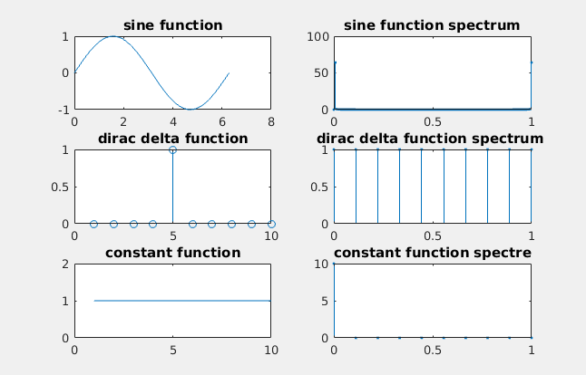

title: Image spectra, fourier transformation, low-pass and high-pass filter
Description: Plotting basic functions and their spectrums, calculating and showing spectrums of grayscale images using 2D fourier transformation, creating low-pass filter and high-pass filter and plotting results 
---
>This whole document works with [image](../media/kytka256.jpg) in `A` variable.
# One-dimensional signal spectrum - sine function, dirac delta function, constant function
## Calculating functions and their spectra
```matlab
x_sin=0:pi/64:2*pi; % creating the signal - sine function
y_sin=sin(x_sin);

x_dirac=1:10; % creating the signal - dirac delta function
y_dirac=zeros((length(x_dirac)),1);
y_dirac(length(x_dirac)/2)=1;

x_konst=x_dirac;  % creating the signal - const function
y_konst=ones(length(x_dirac),1);

% spectrum calculation using Fast fourier tranform
sp_sin= fft(y_sin); 
sp_dirac=fft(y_dirac); 
sp_konst=fft(y_konst); 

%standardized frequency axis
faxis_sin = linspace(0, 1, length(sp_sin)); 
faxis_dirac = linspace(0, 1, length(sp_dirac)); 
faxis_konst = linspace(0, 1, length(sp_konst)); 
```
## Ploting results
``` matlab
subplot(3,2,1);plot(x_sin,y_sin);title('sine function');
subplot(3,2,2);stem(faxis_sin, abs(sp_sin), '.');title('sine function spectrum')
subplot(3,2,3);stem(x_dirac,y_dirac);title('dirac delta function')
subplot(3,2,4);stem(faxis_dirac, abs(sp_dirac), '.');title('dirac delta function spectrum ')
subplot(3,2,5);plot(x_konst,y_konst);title('constant function')
subplot(3,2,6);stem(faxis_konst, abs(sp_konst), '.');title('constant function spectre')
```

# 2D fast fourier transform to create spectrum of corrugated iron image
``` matlab
% sin creates sine signal, linspace creates a vector with 1 and 50 limits
num_points = 256;
sine_corr_iron = sin(linspace(1,50,num_points)); 
% creates a matrix combining sine_corr_iron num_points - times
corr_iron = repmat(sine_corr_iron, num_points, 1); 

figure
subplot(1, 2, 1)
imshow(corr_iron, [])
title('corrugated iron ')

% spectrum calculation

spektrum_img = fft2(corr_iron); % spectrum calculation using Fast 2D fourier transform
subplot(1, 2, 2)
imshow(fftshift(abs(spektrum_img)), []) % shifts zero frequences to the middle
title('spektrum')


```
High frequencies are on the edges, low frequencies in the middle.

# Fourier transform on a photo, low-pass filter, high-pass filter
## Image preparation
``` matlab
A = (imread('kytka256.jpg'));
im_gr= rgb2gray(A); % creating grayscale image
``` 
## Grayscale image spectrum calculation
``` 
spektrum_img = fft2(im_gr);
spektrum_img_adj = log(fftshift(abs(spektrum_img)));
``` 
## Filtration, mask creation
``` 
im_size = size(im_gr); % image size
d = 20; % interval width for binary mask square
mask_lp = zeros(im_size(1), im_size(2)); % mask creation
% mask creation from the middle
mask_lp((im_size(1)/2)-d:(im_size(1)/2)+d, (im_size(2)/2)-d:(im_size(2)/2)+d) = 1; 
``` 
## Low-pass filtration
``` matlab
% spectrum multiplied by mask
spektrum_filt_lp = fftshift(spektrum_img) .* mask_lp; 
img_lp = ifft2(spektrum_filt_lp); % inverse fourier transform
``` 
## Inverse mask using, high-pass filter
``` matlab
% using inverse mask
spektrum_filt_hp = fftshift(spektrum_img) .* (~mask_lp);
img_hp = ifft2(spektrum_filt_hp); % inverse  fourier transform
```
## Plotting results
``` matlab
subplot(3,3,1)
imshow(im_gr)
title('Original grayscale img')
subplot(3,3,2)
imshow(spektrum_img_adj, [])
title('spectrum')

% display of low-pass filtration result
subplot(3, 3, 4)
imshow((abs(img_lp)), []),title('after low-pass filter')
title('after low-pass filter')
subplot(3,3,5)
imshow(log(abs(spektrum_filt_lp)), [])
title('spectrum')
subplot(3, 3, 6)
imshow(mask_lp)
title('mask')

% display of high-pass filtration result
subplot(3, 3, 7)
imshow((abs(img_hp)), []),title('after high-pass filter')
title('after high-pass filter')
subplot(3,3,8)
imshow(log(abs(spektrum_filt_hp)), [])
title('spectrum')
subplot(3, 3, 9)
imshow(~mask_lp)
title('mask') 
```


