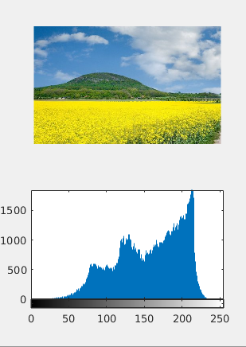
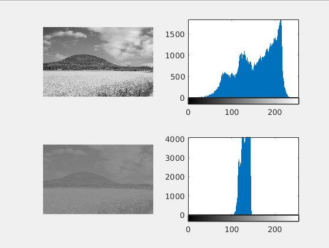

title: Histogram-based operations on images
Description: Histogram plotting, histogram based equalization, deequalization. Creating tool for interactive partial highlighting of teeth x-ray
---
>This document works with three images: 
* [image](/zodoc/assets/img/rip_histogramy.jpg) in `A` variable
* matlab default image pout.tif in `B` variable 
* [teeth x-ray image](/zodoc/assets/img/zubRtg.png) in `C` variable.
# Histogram plotting
```matlab
A=imread('rip_histogramy.jpg'); % loading an image
As=rgb2gray(A); % conversion to grayscale
H = imhist(As); % histogram
subplot(2,1,1)
imshow(A) % original picture
subplot(2,1,2)
imhist(As) % histogram display
```

# Histogram and equalized histogram
``` matlab
B=imread('pout.tif');

subplot(2,2,1)
imshow(B)
subplot(2,2,2)
imhist(B)

% image equalization
subplot(2,2,3)
imshow(histeq(B))
subplot(2,2,4)
imhist(histeq(B)) % equalized histogram display 
```

# Image "deequalization" - contrast lowering
``` matlab
figure

subplot(2,2,1
imshow(As)
subplot(2,2,2)
imhist(As)

dq=(As*0.2)+100; % image equalisation via multiplication and 
subplot(2,2,3)
imshow(dq)
subplot(2,2,4)
imhist(dq) 
```

# Local contrast increase on teeth x-ray image
## Making button, that enables user to pick a square and replacing it with equalized one
``` matlab
C=imread('zubRtg.png')
button=1; % button 
x=300;y=300; % square size - smaller, better depiction
figure;
ax = axes; % picking up axes

while button==1 % left-click on button
if x>100 && y >100 % excludinh picture margins
z_ekv=C;
z_ekv(x-100:x+100,y-100:y+100)=histeq(z_ekv(x-100:x+100,y-100:y+100));
imshow(z_ekv,'Parent',ax)
end

[y,x, button]=ginput(1); %waiting for button press
end 
```

## Adaptive equalization
``` matlab
subplot(2,1,1), imshow(C)
z_ekvadaptive=adapthisteq(C,'NumTiles',[100 100]); %adaptivni ekvalizace
subplot(2,1,2), imshow(z_ekvadaptive) 
```

