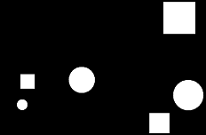

Úvod
====

Složka *imgs_test2* obsahuje binární obrázky s různými tvary. Tvary jsou
ve skutečnosti dva. Čtverec a kruh. Tvary nabývají různých velikostí a mohou se
překrývat.

Zadání
======

Vaším úkolem je odstranit z obrázku útvary které se překrývají:

(Pochopitelně automatizovaně s využitím MATLABu)

Upravené obrázky uložte do složky *imgs_result*. K dispozici máte i kód, který
byl použit pro generování vstupních obrázků (*shapes_generator.m*). Vytvořené
řešení by mělo fungovat na jakýchkoliv vygenerovaných obrázcích.
