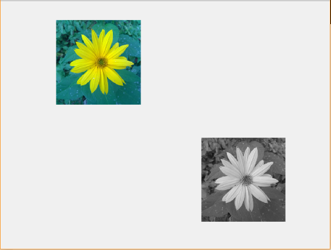
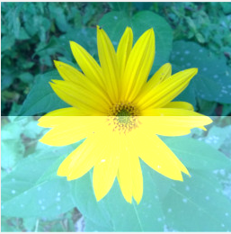
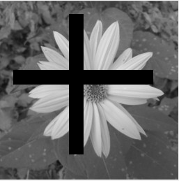
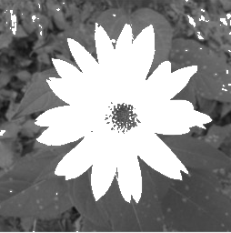
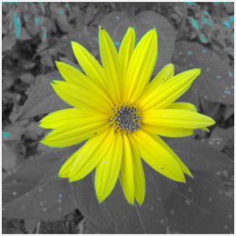

title: Test základních znalostí 1
---
>Tento dokument pracuje se dvěma obrázky: 

* [Obrázek kytky](media/test_basic_1_7.jpg) v proměnné `A` 
* [Obrázek Norska](media/tes_basic_1_8.jpg) v proměnné `B`

# Úvod
Test obsahuje 6 otázek. Maximalně můžete získat 21 bodů.
# Kytka
(2 body) Zobrazte obrázek kytky a jeho šedotónovou alternativu tak jak je na ukázce níže.

# Kytkonor
(3 body) Vytvořte společný obrázek květiny a přírody Norska (nor256.jpg) tím že zkombinujete barevné kanály obou obrázků. Výsledek se od následující ukázky může barevně lišit. Důležité je, aby na obrázku byly znatelné oba podklady.

# Světlejší
(3 body) Zesvětlete květinu na dolní polovině obrázku o okem postřehnutelnou hodnotu.

# Křížem
(3 body) Přidejte k šedotónové variantě květiny černý křiž. Rozměry kříže budou minimálně v desítkách pixelů a kříž se nesmí dotýkat stran obrázku. Kříž nemusí být pravidelný.

# Vysvětlená kytka
(4 body) Na místech, kde šedotónová květina dosahuje hodnot větších než 128, obrázek přeexponujte (tj. nastavte maximální hodnotu jasu).

# Vybarvená květina
(6 bodů) Na místech, kde šedotónová květina dosahuje hodnot větších než 128, obrázku dodejte původní barvy.

