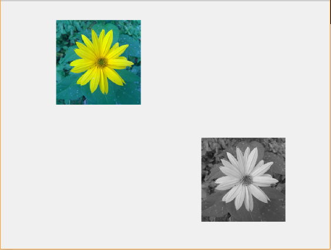
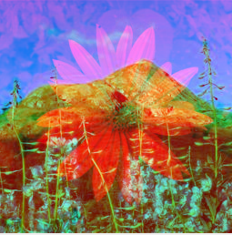
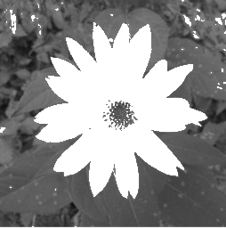

title: Basic knowledge test 1
---
> this document utilizes 2 images

* [Image of a flower](../media/kytka256.jpg) in variable `A` 
* [Image of Norwegian landcape](../media/test_basic_1_8.jpg) in variable `B`

# Introduction
This test contains 6 exercises. Maximum number of points that you can gain is 21.
# Flower
(2 points) Display an image of a flower and its grayscale version as shown below

# Flower-Norwegian landscape combo
(3 points) Create a merged image of a flower and norwegian landscape by combining RGB channels of both images. The result might differ from the image below, but the most important thing is, that the images are distinguishable.

# Brightness
(3 points) Add more brightness to the lower half of the flower picture by value perceptible by naked eye.

# Cross
(3 points) Add a black cross to the grayscale version of flower. The dimensions of the cross must be at least in tens of pixels. The cross must not touch the border of the image. The cross doesn't need to be precise.

# Overexposed flower
(4 points) In the image entries, where the grayscale image value exceeds 128, set a maximum possible value.

# Coloured flower
(6 points) In the image entries, where the grayscale image value exceeds 128, show original colours.

