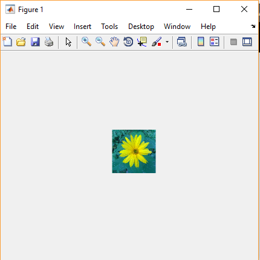
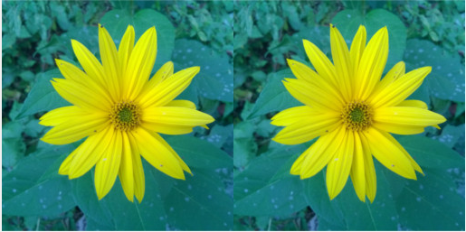
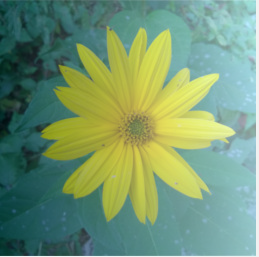

title: Basic knowledge test 2
---
>This document utilizes 2 images

* [image of flower](../media/kytka256.jpg) in `A` variable

# Introduction
This test contains 6 exercises. Maximum number of points you can gain is 21.
# Flower in the middle 
(2 points) Using *subplot* function display flower in the middle of figure.

# Double-flower
 (3 points) Create and display an image consisting of 2 tiled flowers. The resulting image will have a size of 256x512 pixels.

# Gray stripe
(4 body) Create a gray stripe across the image (gray scale representation of image on the location of stripe). Stripe must be tens of pixels thick, however, it must occupy a smaller part of the image then colorful representation. The stripe should not touch the bottom or upper edges.

# Average in range
(6 points) In gray-scale flower image replace all pixels that are larger than 120 and less than 220 by the average of all those pixels in the image. (This average is not (but could be) average from 120 and 220).

# Gradient
(3 body) Create and display gradient image. Be careful about displaying `double` values as image.

# Flower-shadow 
(3 points) Create a regular lightening flower. Almost the whole area is lightened. The lightening increases with the increasing column. Hint: **Gradient**.

