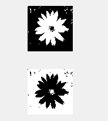
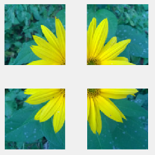


title: Basic knowledge test 2018a
---
>This document utilizes an image: 
 
* [Image of flower](../media/kytka256.jpg) in variable `A` 

# Introduction
This test contains 3 exercises. Maximum number of points that you can get is 8 (7+1 bonus).
# Eclipse of a square moon
(3 points) Display an image, which is created below. The hint: you will need to create a vector and probably a function `repmat`.
 

 
# Two binary images
(2 points) Convert the flower to a binary representation. Always in a different way. Display in one figure below. 

 
# The quartering
(2 points) Divide the flower into quarters and show it in one figure. +1 point for creating a script, which will be able to do it with whichever RGB image of any size.
 

