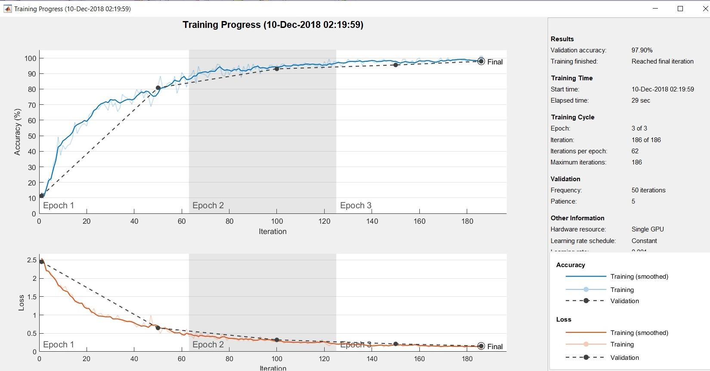

Title: Tvorba a testování CNN pro rozpoznávání čísel
Description: Data po načtení projdou seznamem hlubokých učebních vrstev. Dále jsou nastaveny možnosti tréninku a závěrem je určeno, jaké číslo bylo pomocí této metody rozpoznáno.
--- 

>Tento dokument pracuje s [obrázkem čísla](../media/2018-12-10-14-55-05.png) v proměnné `C`


Výsledný trénovací graf, kde je vyobrazen průběh tréninku. Můžeme zde zjisti přesnost tréninku, která byla 97,90 %. Graf zachycuje několik epoch, přičemž jedna epocha je úplný průchod celým datovým souborem.



``` matlab
%% Načtení dat
digitDatasetPath = fullfile(matlabroot,'toolbox','nnet', 'nndemos','nndatasets', 'DigitDataset');
imds = imageDatastore(digitDatasetPath, 'IncludeSubfolders', true, 'LabelSource', 'foldernames');
% Prvním parametrem je vždy cesta, dále jsou zde určeny další volitelné parametry. Úložistě dat obsahuje 10 000 obrazů číslic 0 až 9.
[imdsTrain, imdsValidation] = splitEachLabel (imds, 0.8, 'randomize');%Výstupem jsou dvě množiny, a to imdsTrain (trénovací) a imdsValidation (validační)

%% Tvorba vrstev
layers = [
    imageInputLayer([28 28 1]) % Vstupní vrstva, jedná se o šedotónový obrázek.
    convolution2dLayer(5,16,'Padding', 'same') % Druhá vrstva je konvoluce, kde je uveden počet konvolučních filtrů, výstup po konvoluci bude stejný.
    batchNormalizationLayer % Normalizační vrstva.
    reluLayer % V případě, že bude výsledek větší, než nula, tak bude vracet součet a v opačném případě, bude vracet nulu. 
    
    % Vylepšení - opakováným přídáním těchto tří vrstev
    convolution2dLayer(5,32,'Padding', 'same')
    batchNormalizationLayer 
    reluLayer
    
    maxPooling2dLayer(2, 'Stride', 2) % Dvakrát zmenšení obrázku (další možnosti nastavená na max/min/průměr). Parametry jsou velikosti čtverečku (2) a dále velikost kroku (2).
    fullyConnectedLayer(10) % Přijámá jedinný parametr a to počet volných neuronů. 
    softmaxLayer % Všechny pravděpodobnosti se posčítají do jedničky. 
    classificationLayer % Řekne nám o jaké číslo se jedná.

%% 
options = trainingOptions('sgdm', 'ValidationPatience', 5, 'Shuffle', 'every-epoch','InitialLearnRate', 0.001, 'Verbose', false, 'Plots', 'training-progress', 'MaxEpoch',3, 'ValidationData', imdsValidation); 
% Sgdm - použije  stochastický gradientní sestup s optimalizátorem hybnosti. Hledání minima v okolí, prohlédnutí přes lokální maximum.
% ValidationPatience - automatické zastavení pomocí ověření je vypnuto. Toto chování zabraňuje ukončení tréninku před dostatečným učením z dat.
% MaxEpoch - maximální počet epoch.
% ValidationData - validační data.

%% Výstup natrénované cnn sítě 
net = trainNetwork (imdsTrain, layers, options); % Přijímá architekturu sítě, data na kterých trénuje a parametry trénování.

%%
C = imadjust (imcomplement (imresize ( rgb2gray (imread('cislo.jpg')),[28 28]))); % Upraví intenzity barev, změní velikost obrázku, převede na šedotónový obrázek a to vše provede s načteným obrázkem čísla.
classify(net, C) % Klasifikujte data pomocí naučené hluboké neuronové sítě.

```