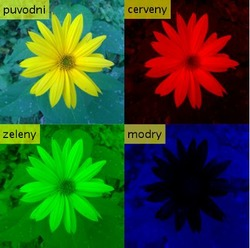

title: Obarvené barevné kanály
lead: Rozdělení a zobrazení obarvených RGB kanály obrázku
Published: 2019-01-04
Tags: [matlab, RGB, channels]
datazooFiles: imgs/kytka256.jpg
prerequisites: [Matlab]
Authors: [tesar-tech, Karina9510]
---
Script zobrazuje jednotlivé obarvené kanály na RGB obrázku.
Pro implementaci jen jednoho barevného RGB kanáu na obrázku je nutno natavit hodnoty ostatních barev na nulu.

``` matlab
A = imread('kytka256.jpg');
R = A; G = A; B = A; 
R(:,:,[2,3])= 0;
G(:,:,[1,3])=0;
B(:,:,[1,2])=0;

montage({insertText(A,[1 1],'puvodni','FontSize',22),...
         insertText(R,[1 1],'cerveny','FontSize',22),...
         insertText(G,[1 1],'zeleny','FontSize',22),...
         insertText(B,[1 1],'modry','FontSize',22)});
```

