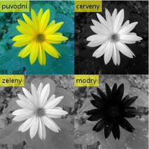

title: Jednotlivé barevné kanály
lead: Rozdělení a zobrazení barevných kanálů obrázku
Published: 2019-01-03
Tags: [matlab, RGB, channels]
datazooFiles: imgs/kytka256.jpg
prerequisites: [Matlab]
Authors: [tesar-tech, Karina9510]
---
Script zobrazuje jednotlivé barevné kanály na RGB obrázku.
Ve případě zobrazení vybraného barevného kanálu na původním obrázku se objevují šedé pixely. Tohle to se projevuje v tom případě, když už do existujícího barevného kanálu, který obsahuje vysokou koncentraci čistší barvy tohoto kanalu, se přidávají  jiný barevný kanál. Tyto oblasti odpovídají hodnotám pixelů, které neobsahují žádné hodnoty původně existujícího RGB kanálů.

Jestli sloučením několika barevných kanálů na obrázku se objevují bílé oblasti, to znamená, že v tom to mistě se sčítají všechny tři existujicí barevné kanaly. 

``` matlab
A = imread('kytka256.jpg');
R=insertText(A(:,:,1),[1 1],'cerveny','FontSize',22);
G=insertText(A(:,:,2),[1 1],'zeleny','FontSize',22);
B=insertText(A(:,:,3),[1 1],'modry','FontSize',22);
montage({insertText(A,[1 1],'puvodni','FontSize',22), R, G, B});
```


