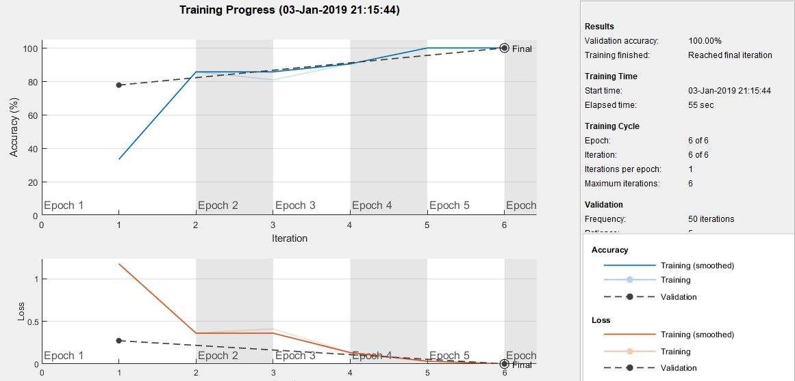

title: Transfer learning
lead: Convolutional neural network training (CNN)
Published: 2018-12-31
Tags: [matlab, transfer learning]
prerequisites: [Matlab]
Authors: [tesar-tech, Karina9510]
---
This script carry out  a convolutional neural network training (CNN). The training of image classification problems is provided by the input image data stores, the network architecture layers, and the training options. Validation accuracy of the method is 100%.

``` matlab
net = alexnet;
imds = imageDatastore('imgs_shapes', 'IncludeSubfolders', true, 'LabelSource', 'foldername') 
%creates a datastore from the collection of image data specified by location,...
%subfolder of the comma-separated pair,label data and name

[imdsTrain, imdsValidation] = splitEachLabel(imds, 0.7);
%split imds to two datastores specifying that each datastore contains 70% of each label and ...
%the corresponding files

layersToStay = net.Layers(1:22) % creating new layers
layers = [
    layersToStay
    fullyConnectedLayer(3) %creates a fully connected layer with an output size of 3
    softmaxLayer %creates a softmax layer
    classificationLayer %creates a classification layer
    ]

options = trainingOptions('sgdm',... %set training options: the stochastic gradient with momentum optimizer
    'Shuffle', 'every-epoch',... %shuffles the training data before each training epoch and...
    							 %shuffles the validation data before each network validation
    'Verbose', false, 'plots', 'training-progress',... % display training progress information in the command window
    'MaxEpoch', 6, ... %maximum number of epochs to use for training
    'ValidationData', imdsValidation) %use data for validation during training - specified as an image datastore
netTransfer = trainNetwork(imdsTrain, layers, options)
%train a network using the store of the input image data, the architecture layers and the training options
```
 
